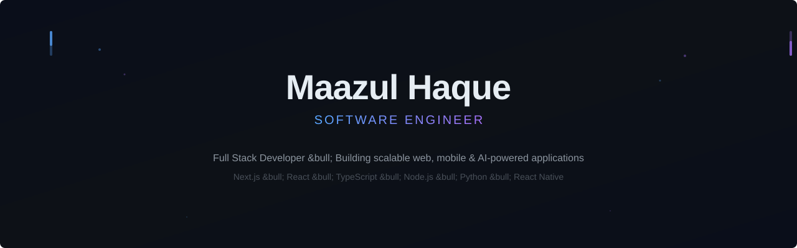

<picture>
  <source media="(prefers-color-scheme: dark)" srcset="dark_mode.svg" />
  <source media="(prefers-color-scheme: light)" srcset="light_mode.svg" />
  
</picture>

---

# Hi, I'm Mazul Haque

### Full Stack Developer

Building modern web applications with a focus on clean architecture and scalable solutions.

---

## Current Direction

I am focused on building production-ready full stack applications with modern JavaScript ecosystems. Currently deepening expertise in scalable backend architecture, real-time systems, and enterprise-grade frontend patterns.

---

## Featured Projects

<table>
<tr>
<td width="50%">

### Halal Pizza Fun

Full-stack food delivery platform with multi-branch ordering, real-time tracking via Socket.io, payment integration (Razorpay), role-based admin dashboards, and PWA support.

**Stack:** Next.js 16, React 19, TypeScript, MongoDB, Socket.io, Tailwind CSS

</td>
<td width="50%">

### Metro Appliances ERP

Enterprise resource planning system covering e-commerce, warehouse, manufacturing, finance, HRMS, CRM, and AI/BI analytics. Frontend serving 6 distinct user portals with 432 lazy-loaded admin pages.

**Stack:** React 18, Vite, Redux Toolkit, Node.js, Express.js, MongoDB

</td>
</tr>
<tr>
<td width="50%">

### FFC - Fitness Fever Club

Premium gym platform frontend with dark UI, GSAP/Framer Motion animations, content management admin dashboard, and responsive design.

**Stack:** React 18, Vite, Tailwind CSS, GSAP, Framer Motion

</td>
<td width="50%">

### Seikh Frontend

React-based frontend application built with Vite and modern tooling.

**Stack:** React, Vite, JavaScript, CSS

</td>
</tr>
</table>

---

## Engineering Stack

<table>
<tr>
<td align="center" width="25%">

**Frontend**

</td>
<td align="center" width="25%">

**Backend**

</td>
<td align="center" width="25%">

**Database & Services**

</td>
<td align="center" width="25%">

**Tools & Deployment**

</td>
</tr>
</table>

---

## Current Focus

<table>
<tr>
<td width="25%">

**Building**

Production-ready full stack applications with real-world complexity

</td>
<td width="25%">

**Learning**

Advanced backend architecture and scalable system design

</td>
<td width="25%">

**Exploring**

Real-time systems, microservices patterns, and cloud deployment

</td>
<td width="25%">

**Improving**

Code quality, testing practices, and development workflow

</td>
</tr>
</table>

---

## GitHub Analytics

<table>
<tr>
<td align="center"></td>
<td align="center"></td>
</tr>
</table>

---

Thank you for visiting.

